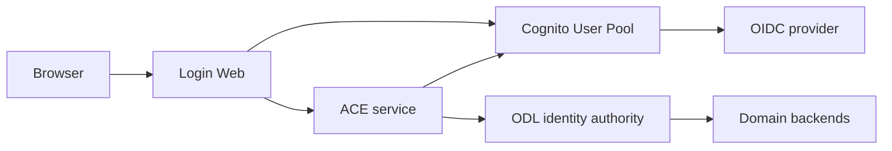

# Architecture and authority boundaries

The browser authenticates through the Login Web backend-for-frontend. Spring Security owns the authorization-code exchange and stores tokens in the server-side session. Login Web sends the Cognito access token only to ACE. ACE validates token signature, issuer, expiry, `token_use` and app-client ID.

ACE is the sole protected-access decision point. It retrieves the current Cognito lifecycle attribute and queries ODL for the authoritative Identity Link Record on every protected request. Only `linked_active` with an active link for the same immutable Cognito `sub` passes. Errors, missing data, unknown states and stale data deny access. ACE has no domain-backend client.

## Implemented OIDC flow

1. The browser selects organization login. Cognito redirects to the configured Ping-compatible OIDC provider.
2. Cognito creates/authenticates the federated account. A trigger initializes a missing lifecycle to `authenticated_unverified`.
3. Login Web displays the identity-triplet form. The form accepts exactly the four approved key/date combinations with ZIP.
4. ACE sets `profile_complete_pending_resolution` and asks ODL to resolve the identity with a 30-second transport timeout.
5. One non-correlation match causes ODL activation followed by Cognito `linked_active`. Zero or multiple matches are recorded in ODL before ACE deletes only the still-pending, federated Cognito account. A timeout becomes `resolution_timeout` and is retriable.
6. Account-correlation results remain blocked until an MFA adapter is implemented.

## Provisional ODL contract

Real ODL endpoint details were not supplied. `OdlClient` therefore encodes a reviewable proposal:

| Method | Endpoint | Required behavior |
| --- | --- | --- |
| POST | `/v1/resolutions` | Resolve approved triplet; return `resolutionId`, `matchCount`, `correlationRequired` within 30 seconds |
| PUT | `/v1/identity-links/{subject}` | Atomically verify resolution ownership and activate/upsert the subject link |
| GET | `/v1/identity-links/{subject}` | Return `{subject, active}` from current authority data |
| POST | `/v1/resolution-events` | Durably record terminal outcome before failed-account cleanup |

ODL must authenticate ACE, serialize attempts by subject, treat retries idempotently, keep terminal resolution decisions immutable for the lifetime of a subject (including concurrent or changed-triplet requests), bind resolution IDs to the same subject, never return raw domain identity records, and keep an immutable audit event. ACE passes the triplet only to ODL and never logs it.

## Known gaps before production

- Confirm and adapt the provisional ODL API and service-authentication method.
- Implement account-correlation MFA before enabling that branch. It currently returns HTTP 409 and grants nothing.
- Add an asynchronous recovery/saga for the ODL-active/Cognito-update partial failure. Current ordering prevents Cognito access from becoming active before ODL, but can leave an ODL link active while Cognito stays pending.
- Confirm Ping claims and endpoint metadata, add the provider secret using protected deployment parameters, and validate triggers with a non-production tenant.
- Place the web session in a shared encrypted store for multiple instances; rotate sessions and secrets; complete relying-application handoff and logout decisions.
- Apply rate limiting, audit events without PII/tokens, operational alerts, HTTPS and private service networking.
- Review lifecycle initialization against the 2026 Cognito inbound-federation trigger before production; the included post-authentication trigger is a portable baseline and updates are visible on the following token issuance.

Direct registration, proprietary MFA, AWL session creation and domain backend implementations are outside this first OIDC login slice.

Registration mutation is opt-in through `REGISTRATION_ENABLED=true`. Keep it disabled until the ODL contract and cleanup/recovery behavior are approved and tested. The Cognito app client cannot write the lifecycle attribute; only the server IAM role can.
